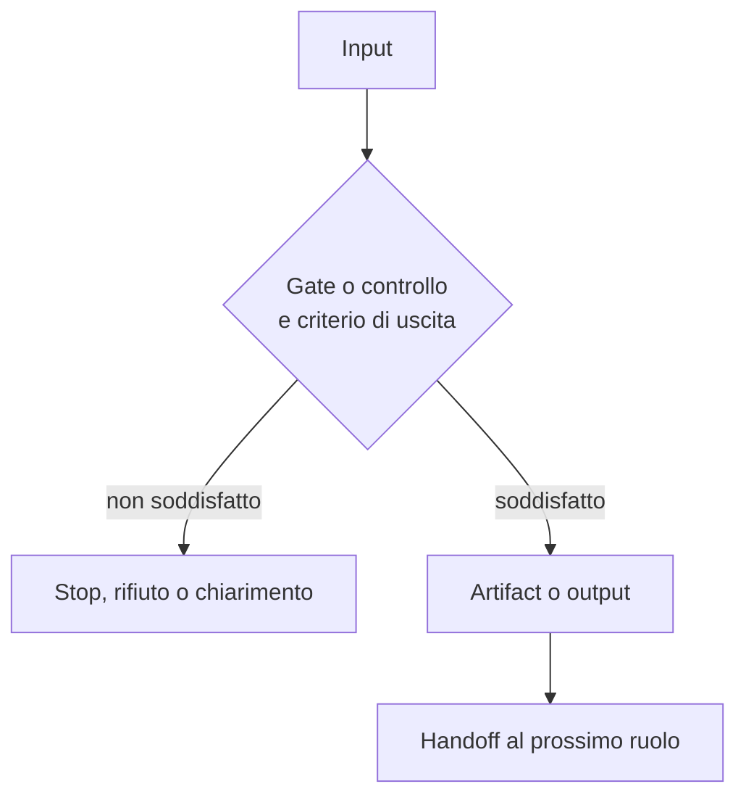

# Mappe Visuali Dei Ruoli

> Approfondimento facoltativo: [biblioteca](../reference/README.md). I contratti di questa implementazione non sono prerequisiti del corso.

[Torna alla lettura principale](../README.md) · [Slide](../slides/README.md) · [Principi](../principles.md)

Mappe didattiche di mandato, confine e handoff. Non prescrivono ruoli, nomi o tool per un repository target.

## Come Leggerle

Ogni pagina contiene una lettura rapida e un flusso Mermaid dettagliato. Il flusso usa sempre la stessa catena:

La tabella sotto ogni diagramma spiega quattro domande: quale decisione protegge il passaggio, quale prova produce, chi riceve l'handoff e cosa accade se il criterio non e soddisfatto. Seguire le frecce non assegna autorita: il contratto canonical collegato resta la fonte di verita.

I gate numerati riprendono quelli del contratto canonical. Nelle mappe prive di gate numerati, i controlli del diagramma sono passaggi didattici: non aggiungono stop, approvazioni o artifact al workflow originale. Un output in chat non diventa un artifact persistito solo perche compare nel diagramma.

## Agent

- [Ask](agents/ask.md)
- [Implementor](agents/implementor.md)
- [Direct Implementor](agents/direct-implementor.md)
- [Integration Tester](agents/integration-tester.md)
- [Knowledge Builder](agents/knowledge-builder.md)
- [Planner](agents/planner.md)
- [Vision](agents/vision.md)

## Skill

- [Author Repo Skill](skills/author-repo-skill.md)
- [Business Logic Gap Detector](skills/business-logic-gap-detector.md)
- [Integration Test Knowledge Checklist](skills/integration-test-knowledge-checklist.md)
- [Plan Bug From Id](skills/plan-bug-from-id.md)
- [Plan User Story From Id](skills/plan-user-story-from-id.md)
- [User Story Analysis](skills/user-story-analysis.md)

## Quale Percorso Scegliere?

| Esigenza | Percorso | Evidenza prima di modificare |
| --- | --- | --- |
| Capire o spiegare | [Ask](agents/ask.md) | Fonti verificabili; nessuna implementazione implicita. |
| Preparare un piano da approvare e passare di mano | [Planner](agents/planner.md) → [Implementor](agents/implementor.md) | Piano approvato e scope leggibile. |
| Implementare dai requisiti senza documento di piano | [Direct Implementor](agents/direct-implementor.md) | Requisiti, regole e decisioni di design validate nei gate. |
| Produrre prove di integrazione | [Integration Tester](agents/integration-tester.md) | Intake e piano di test propri del ruolo; nessun handoff automatico che salti i suoi gate. |

La scelta dipende da autorità e output richiesti, non soltanto dalla dimensione del task. Questi percorsi descrivono la reference implementation; non prescrivono il numero di ruoli del repository target.
