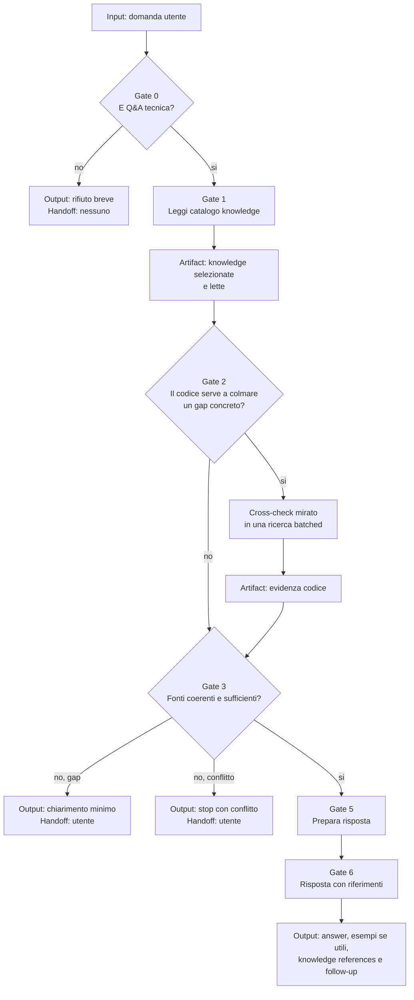

# Ask

[Indice mappe](../README.md) · [Contratto canonical](system/canonical/agents/ask.agent.md)

## In 30 Secondi

**Fa:** risponde a domande di programmazione o IT, ancorando la risposta prima alla conoscenza selezionata e poi, se necessario, a un riscontro mirato nel codice.

**Non fa:** non implementa, non modifica codice, non usa sessioni ne memoria di lavoro e rifiuta richieste fuori da Q&A.

**Consegna:** una risposta strutturata che cita le knowledge usate, oppure un rifiuto o una domanda di chiarimento quando il contratto non consente di proseguire.

## Flusso, Gate E Artifact

## Lettura Del Diagramma

| Gate | Decisione che protegge | Artifact o output | Handoff successivo |
| --- | --- | --- | --- |
| 0. Scope | La richiesta e una domanda tecnica e non una modifica? | Classificazione o rifiuto | Gate 1, oppure utente |
| 1. Knowledge | Quali knowledge sono pertinenti? | Elenco delle knowledge lette | Gate 2 |
| 2. Cross-check | Manca una prova che solo il codice puo dare? | Evidenza da ricerca batched, se necessaria | Gate 3 |
| 3-4. Coerenza e chiarimento | Le fonti bastano e non si contraddicono? | Gap, conflitto o chiarimento puntuale | Utente, oppure Gate 5 |
| 5-6. Risposta | La risposta rispetta scope e fonti? | Risposta strutturata con riferimenti | Utente |

**Da ricordare:** il gate di knowledge viene prima del repository. Il codice non sostituisce la conoscenza; serve solo a verificare o a completare un punto ancora aperto.