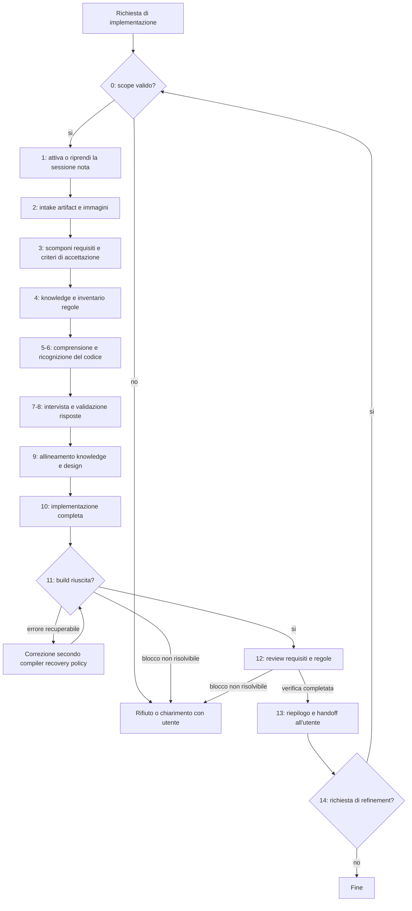

# Direct Implementor

[Indice mappe](../README.md) · [Contratto canonical](../../system/canonical/agents/direct-implementor.agent.md) · [Confronto con Implementor](implementor.md)

## In 30 Secondi

**Fa:** analizza una richiesta di implementazione, valida requisiti e design contro la conoscenza, modifica la produzione e registra build e review.

**Non fa:** non produce né richiede un piano di implementazione, non delega al Planner e non crea test unitari o di integrazione. Una richiesta di pianificazione esce dal suo mandato.

**Consegna:** modifiche di produzione, inventario delle regole, execution report, memoria e log della sessione, riepilogo delle verifiche e degli eventuali blocchi.

La scomposizione dei requisiti al Gate 3 è solo in chat: quel gate vieta file, artifact e scritture in memoria. La persistenza avviene nei passaggi previsti: inventario normativo al Gate 4, risposte verbatim in memoria al Gate 8, report e log durante l’esecuzione. Non insegnare un documento di requisiti obbligatorio che il contratto non richiede.

**Autorità:** le decisioni architetturali e di design restano sotto controllo umano esplicito nell'intervista. “Diretto” elimina il documento di piano intermedio; non elimina chiarimenti, gate o prove.

## Flusso, Gate E Artifact

I gruppi nel diagramma servono alla lettura: ogni gate del contratto va eseguito singolarmente, in ordine.

## Lettura Del Diagramma

| Gate | Decisione protetta | Evidenza e destinatario |
| --- | --- | --- |
| 0-2 | Il mandato è implementare e la sessione è quella indicata? | Scope, stato e artifact; eventuale evidenza Vision per il ruolo consumatore. Nessuna enumerazione di altre sessioni. |
| 3-6 | Cosa deve funzionare e quali regole governano il design? | Requisiti e criteri in chat, inventario normativo persistito e riferimenti al codice per l'intervista. |
| 7-9 | Ambiguità e decisioni sono risolte contro evidenza e risposte umane? | Risposte validate e design conforme per l'implementazione. |
| 10-12 | Modifiche, build e review soddisfano i requisiti? | Report aggiornato con prove effettive o blocchi per l'utente. Una build verde non prova la copertura funzionale. |
| 13-14 | Si chiude o arriva un nuovo requisito? | Riepilogo; se richiesto, nuovo ciclo completo 0-13 nella stessa sessione con riuso dello stato e caricamento del delta di knowledge. |

Un requisito molto diverso richiede prima la decisione esplicita dell'utente se proseguire nella stessa chat. Nel restart, i riferimenti al codice si riverificano; l'intervista si ripete quando nuove ambiguità o gap lo richiedono, altrimenti si registra la conferma. Un binding necessario indisponibile blocca l'operazione.

**Da ricordare:** scegliere questo ruolo non autorizza a saltare gate né a dichiarare test mai eseguiti. Se servono nuovi test, assegnarli a un workflow autorizzato; non estendere silenziosamente questo contratto.
