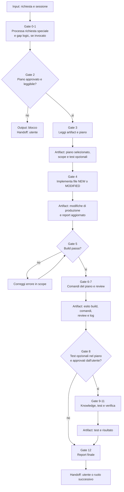

# Implementor

[Indice mappe](../README.md) · [Contratto canonical](system/canonical/agents/implementor.agent.md)

## In 30 Secondi

**Fa:** trasforma un piano di implementazione approvato in modifiche conformi al piano, quindi registra build, comandi richiesti e verifica.

**Non fa:** non sceglie un piano non approvato. I test unitari descritti nel piano restano opzionali finche l'utente non li approva esplicitamente; l'eccezione e il workflow `business_logic_gap_detector`.

**Consegna:** report di esecuzione, aggiornamenti di sessione e handoff con stato delle modifiche e delle verifiche.

## Flusso, Gate E Artifact

## Lettura Del Diagramma

| Gate | Decisione che protegge | Artifact o output | Handoff successivo |
| --- | --- | --- | --- |
| 0-1. Richiesta speciale | E stato invocato il detector di business logic? | Triage e, se applicabile, test rossi e riparazione stretta | Gate 2 |
| 2. Piano | Esiste un solo piano approvato e leggibile? | Piano risolto o blocco | Gate 3, oppure utente |
| 3-4. Intake e implementazione | Quali file e quali limiti definisce il piano? | Modifiche previste, execution report, log e memory | Gate 5 |
| 5-7. Build, comandi, review | Build e operazioni richieste provano la modifica? | Evidenza di build, comandi e review | Gate 8 |
| 8-11. Test opzionali | L'utente ha autorizzato i test descritti nel piano? | Richiesta esplicita, test e risultato | Gate 12 |
| 12-13. Chiusura | Quale stato e quale follow-up restano? | Summary finale e refinements, se richiesti | Utente o prossimo ruolo |

**Da ricordare:** il piano autorizza le modifiche di produzione; non autorizza automaticamente la creazione di test opzionali.

**Confronto:** [Direct Implementor](direct-implementor.md) parte da requisiti validati senza piano intermedio e non crea alcun test. Il vincolo del piano approvato appartiene a Implementor, non a tutti i percorsi di implementazione.
