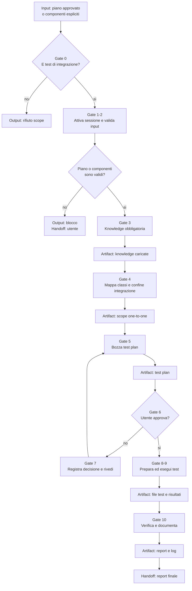

# Integration Tester

[Indice mappe](../README.md) · [Contratto canonical](system/canonical/agents/integration-tester.agent.md)

## In 30 Secondi

**Fa:** pianifica, approva con l'utente ed esegue solo test di integrazione, mantenendo una corrispondenza di un file test per ogni classe di produzione applicabile.

**Non fa:** non modifica produzione e non svolge test unitari, system o end-to-end. Parte solo da un piano approvato oppure da componenti specificati dall'utente.

**Consegna:** test plan approvato, test di integrazione, evidenza di verifica e report di handoff.

## Flusso, Gate E Artifact

## Lettura Del Diagramma

| Gate | Decisione che protegge | Artifact o output | Handoff successivo |
| --- | --- | --- | --- |
| 0-2. Scope e precondizioni | Il lavoro e integrazione e ha input validi? | Sessione attiva, piano o componenti risolti; altrimenti blocco | Gate 3 |
| 3. Knowledge | Quali regole obbligatorie disciplinano i test? | Knowledge catalog e documenti letti | Gate 4 |
| 4. Scope | Quali classi richiedono un test di integrazione? | Mappa produzione-test e confine reale | Gate 5 |
| 5-7. Piano e approvazione | Il test plan e pronto e approvato? | Bozza, decisione dell'utente e piano revisionato | Gate 8 |
| 8-10. Esecuzione e prova | I test dimostrano l'integrazione nel perimetro? | File test, output di verifica, report e log | Gate 11 |
| 11. Handoff | Cosa e stato eseguito e cosa resta aperto? | Report finale e follow-up | Utente o ruolo successivo |

**Da ricordare:** qui il gate di approvazione e prima della scrittura dei test, e il confine impedisce di trasformare una failure in una modifica di produzione.

## Schema Del Piano Di Test

Il piano di test deve dichiarare i campi e il ciclo di vita che il workflow di integrazione richiede. Un documento che descrive soltanto i gate non è uno schema compatibile. La disponibilità delle fonti e dei binding di lettura va verificata prima dell'handoff.
