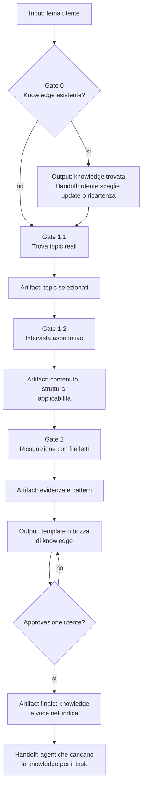

# Knowledge Builder

[Indice mappe](../README.md) · [Contratto canonical](../../system/canonical/agents/knowledge-builder.agent.md)

## In 30 Secondi

**Fa:** legge il repository per produrre knowledge applicabile da un agente che non conosce il progetto, basata su evidenza reale e salvata come knowledge riusabile.

**Non fa:** non modifica codice di produzione, non confonde nomi file con evidenza e non trasforma supposizioni in fatti.

**Consegna:** topic e aspettative come artifact di sessione, quindi una knowledge pubblicata nell'indice con intent e contenuto applicabile.

## Flusso, Gate E Artifact

## Lettura Del Diagramma

| Gate | Decisione che protegge | Artifact o output | Handoff successivo |
| --- | --- | --- | --- |
| 0. Knowledge esistente | Si aggiorna una base utile o si parte da zero? | Esito del catalogo e scelta utente | Gate 1.1 |
| 1.1. Topic | Quali concetti distinti esistono davvero nel codice? | Artifact per ogni topic scelto | Gate 1.2 |
| 1.2. Aspettative | Cosa deve sapere e come usera la knowledge il destinatario? | Artifact di intervista | Gate 2 |
| 2. Ricognizione | Quali prove derivano da file realmente letti? | Evidenza, relazioni e esempi | Bozza |
| Bozza e approvazione | La knowledge e utile, supportata e leggibile senza contesto? | Template o draft approvato | Pubblicazione |
| Pubblicazione | Dove la trovera il prossimo agente? | Documento e indice aggiornato | Ruoli che consultano la knowledge |

**Da ricordare:** un artifact di ricerca non e ancora knowledge. Diventa riusabile soltanto dopo bozza, approvazione e pubblicazione nell'indice.
