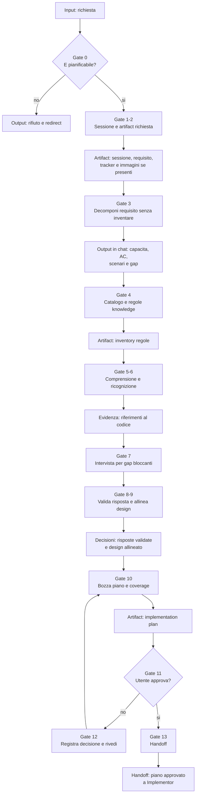

# Planner

[Indice mappe](../README.md) · [Contratto canonical](../../system/canonical/agents/planner.agent.md)

## In 30 Secondi

**Fa:** trasforma una richiesta valida in un piano di implementazione completo, fondato su requisito, knowledge e ricognizione, e lo consegna solo dopo revisione e approvazione.

**Non fa:** non implementa, non esegue comandi, non produce test di integrazione e non salta la scelta della sessione o l'approvazione del piano.

**Consegna:** artifact di requisito, analisi, knowledge e piano; poi il piano approvato per l'Implementor.

## Flusso, Gate E Artifact

## Lettura Del Diagramma

| Gate | Decisione che protegge | Artifact o output | Handoff successivo |
| --- | --- | --- | --- |
| 0-2. Scope e sessione | La richiesta merita un piano, e in quale sessione? | Sessione scelta, requisito e artifact di intake | Gate 3 |
| 3. Requisito | Cosa chiede il dominio senza aggiungere assunzioni? | Capacita, acceptance criteria, scenari e gap esposti in chat, senza artifact | Gate 4 |
| 4. Knowledge | Quali regole governano il design? | Catalogo, knowledge lette e inventory normativo | Gate 5 |
| 5-9. Evidenza e allineamento | Evidenza, regole e chiarimenti sostengono il design? | Ricognizione, chiarimenti e decisioni validate | Gate 10 |
| 10. Piano | File, dettagli e coverage sono eseguibili? | Bozza di implementation plan | Gate 11 |
| 11-12. Approvazione | L'utente accetta il piano? | Decisione esplicita e revisione, se necessaria | Gate 13 |
| 13. Handoff | Quale piano puo essere implementato? | Piano approvato e artifact di sessione | Implementor |

**Da ricordare:** il Planner produce un contratto per l'esecuzione. La sua prova non e il codice scritto, ma un piano approvato, completo e tracciabile.

## Ispezionare Il Piano Prima Del Handoff

Lo [schema del piano](../../system/canonical/templates/plan-schema.md) si carica subito prima di scrivere o riparare il piano. Richiede quattro sezioni, collegamenti esatti fra albero e dettagli dei file e backlink; gli anchor prescritti si preservano anche se un lint li segnala. Per file modificati, ogni zona usa un blocco `diff` a colonna 1 con metodo o sezione completa; i file nuovi mostrano il contenuto completo. Gli esempi dello schema governano il formato.

`Coverage Scenarios` deriva dal codice mostrato e separa ogni regola o ramo di business materialmente distinto: happy path, guardie, errori, ritorni anticipati o no-op quando presenti. Non basta un solo happy path; non si richiede copertura di ogni riga. La tabella usa esattamente `Test name scenario` e `Description`, con naming dalla knowledge o fallback dello schema. Senza nuova logica si può omettere il recap; in quel caso la coverage è il letterale `None`. I recap di più metodi usano sottosezioni a elenco con nome in grassetto.

Gli scenari sono pianificazione, non test eseguiti. File e operazioni di unit test non entrano nelle sezioni 2 e 4. Nell'eccezione di pianificazione per solo test su produzione invariata, lo schema ammette `UNMODIFIED` e prescrive il testo della sezione 4 senza tabella operativa. Questi vincoli appartengono al percorso con piano e non introducono un piano per Direct Implementor.
