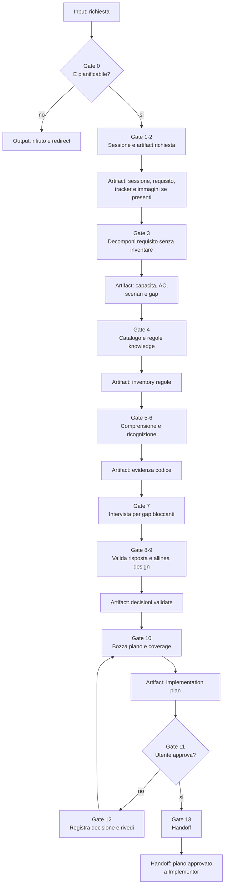

# Planner

[Indice mappe](../README.md) · [Contratto canonical](../../../system/canonical/agents/planner.agent.md)

## In 30 Secondi

**Fa:** trasforma una richiesta valida in un piano di implementazione completo, fondato su requisito, knowledge e ricognizione, e lo consegna solo dopo revisione e approvazione.

**Non fa:** non implementa, non esegue comandi, non produce test di integrazione e non salta la scelta della sessione o l'approvazione del piano.

**Consegna:** artifact di requisito, analisi, knowledge e piano; poi il piano approvato per l'Implementor.

## Flusso, Gate E Artifact

## Lettura Del Diagramma

| Gate | Decisione che protegge | Artifact o output | Handoff successivo |
| --- | --- | --- | --- |
| 0-2. Scope e sessione | La richiesta merita un piano, e in quale sessione? | Sessione scelta, requisito e artifact di intake | Gate 3 |
| 3. Requisito | Cosa chiede il dominio senza aggiungere assunzioni? | Capacita, acceptance criteria, scenari e gap | Gate 4 |
| 4. Knowledge | Quali regole governano il design? | Catalogo, knowledge lette e inventory normativo | Gate 5 |
| 5-9. Evidenza e allineamento | Evidenza, regole e chiarimenti sostengono il design? | Ricognizione, chiarimenti e decisioni validate | Gate 10 |
| 10. Piano | File, dettagli e coverage sono eseguibili? | Bozza di implementation plan | Gate 11 |
| 11-12. Approvazione | L'utente accetta il piano? | Decisione esplicita e revisione, se necessaria | Gate 13 |
| 13. Handoff | Quale piano puo essere implementato? | Piano approvato e artifact di sessione | Implementor |

**Da ricordare:** il Planner produce un contratto per l'esecuzione. La sua prova non e il codice scritto, ma un piano approvato, completo e tracciabile.