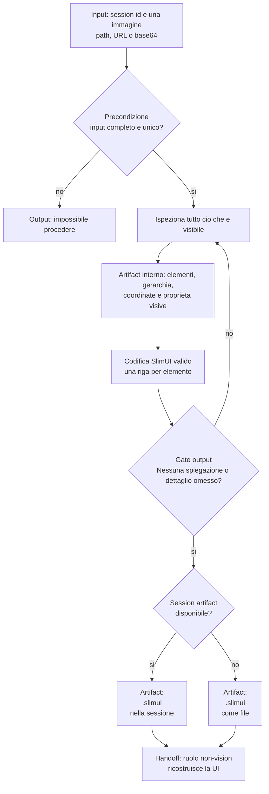

# Vision

[Indice mappe](../README.md) · [Contratto canonical](system/canonical/agents/vision.agent.md)

## In 30 Secondi

**Fa:** trasforma una sola immagine in un artifact SlimUI dettagliato, deterministico e leggibile da un modello senza capacita visive.

**Non fa:** non interpreta oltre cio che e visibile. L'immagine e l'unica fonte di verita e ogni dettaglio omesso dall'artifact risulta inesistente per il consumatore.

**Consegna:** un artifact di sessione SlimUI, oppure un file `.slimui` quando la persistenza di sessione non e disponibile.

## Flusso, Gate E Artifact

## Lettura Del Diagramma

| Passaggio | Decisione che protegge | Artifact o output | Handoff successivo |
| --- | --- | --- | --- |
| Input | Esistono sessione e una sola immagine valida? | Input accettato o stop | Ispezione |
| Ispezione | Quali elementi sono effettivamente visibili? | Mappa completa di gerarchia e proprieta | Codifica |
| Codifica | Lo SlimUI conserva posizione, dimensioni e proprieta non predefinite? | Specifica SlimUI | Gate output |
| Gate output | L'artifact e completo e senza prosa aggiuntiva? | SlimUI valido | Persistenza |
| Persistenza | Esiste la persistenza di sessione? | Artifact di sessione o file `.slimui` | Ruolo consumatore |

**Da ricordare:** il passaggio cruciale non e una descrizione estetica; e una codifica completa. Una parte visibile assente dallo SlimUI non puo essere ricostruita dal ruolo successivo.

## Decisione Sul Modello

Quando Vision è selezionato, verificare il supporto dell'ambiente e registrare il modello effettivamente usato. Un default canonical è una raccomandazione da verificare, non una scelta universale. Questa decisione non cambia l'autorità dell'immagine né il formato dell'artifact.
