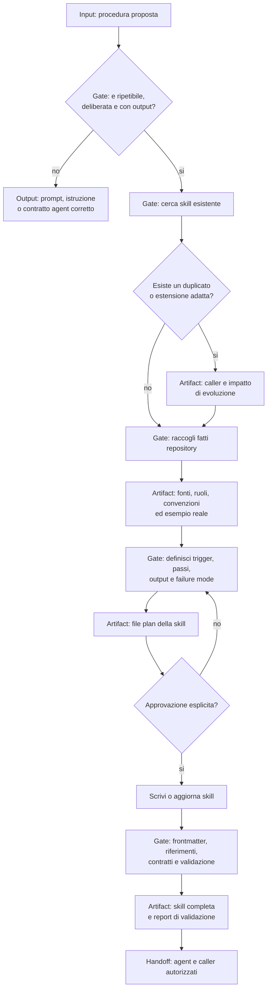

# Author Repo Skill

[Indice mappe](../README.md) · [Contratto canonical](../../system/canonical/skills/author-repo-skill/SKILL.md)

## In 30 Secondi

**Fa:** decide se una procedura ripetibile merita una repository-local skill e, dopo approvazione, la rende un contratto con input, output, failure mode e validazione.

**Non fa:** non usa una skill per un'azione una tantum, per una regola globale o per un vincolo proprio di un agent. Non inventa tool, path o comandi non trovati nella discovery.

**Consegna:** una skill approvata e validata, con artifact finale deterministico e chiamanti compatibili.

## Flusso, Gate E Artifact

## Lettura Del Diagramma

| Gate | Decisione che protegge | Artifact o output | Handoff successivo |
| --- | --- | --- | --- |
| Casa giusta | La procedura e davvero una skill? | Redirect a prompt, istruzione o agent contract | Proprietario corretto |
| Duplicazione | Si estende un contratto esistente? | Analisi di caller e compatibilita | Raccolta fatti |
| Raccolta | Quali fatti repository-specific rendono valida la skill? | Fonti, ruoli, convenzioni e caso reale | Definizione |
| Definizione e approvazione | Trigger, passi e output sono verificabili e approvati? | File plan approvato | Scrittura |
| Validazione | Tutti i riferimenti esistono e l'artifact e deterministico? | Skill e report di validazione | Agent/caller autorizzati |

**Da ricordare:** la richiesta diventa una skill solo quando il suo output e riconoscibile e ripetibile. L'approvazione precede sempre la scrittura.
