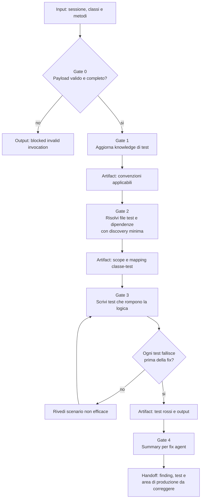

# Business Logic Gap Detector

[Indice mappe](../README.md) · [Contratto canonical](../../../system/canonical/skills/business-logic-gap-detector/SKILL.md)

## In 30 Secondi

**Fa:** crea test unitari che dimostrano una debolezza praticabile della logica di produzione e verifica che ogni nuovo test fallisca prima della correzione.

**Non fa:** non modifica la produzione, non inventa scenari impossibili e non accetta un test verde come prova di un gap.

**Consegna:** test rossi, finding ordinati per severita e una nota precisa per il ruolo che dovra correggere la produzione.

## Flusso, Gate E Artifact

## Lettura Del Diagramma

| Gate | Decisione che protegge | Artifact o output | Handoff successivo |
| --- | --- | --- | --- |
| 0. Invocazione | Sessione, classe e metodi sono tutti presenti? | Blocco deterministico o scope valido | Gate 1 |
| 1. Knowledge | Quali convenzioni disciplinano i test? | Knowledge di test aggiornata | Gate 2 |
| 2. Scope | Dove vivono test, helper e dipendenze necessarie? | Mapping produzione-test e target file | Gate 3 |
| 3. Prova rossa | Il caso espone una debolezza reale e fallisce? | Test rossi e output della failure | Gate 4 |
| 4. Handoff | Cosa deve correggere il prossimo ruolo? | Finding ordinati e area di produzione | Fix agent |

**Da ricordare:** il gate decisivo e la prova rossa. Un test che passa non dimostra un business logic gap e deve essere rielaborato, non consegnato.