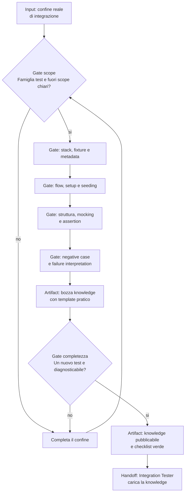

# Integration Test Knowledge Checklist

[Indice mappe](../README.md) · [Contratto canonical](../../../system/canonical/skills/integration-test-knowledge-checklist/SKILL.md)

## In 30 Secondi

**Fa:** guida la costruzione di una knowledge project-specific che permetta di creare e diagnosticare test di integrazione nel confine reale del progetto.

**Non fa:** non sostituisce una convenzione locale con consigli generici e non confonde test di integrazione con unit, system o end-to-end test.

**Consegna:** una knowledge indicizzata con metadata, stack, setup, seeding, mocking, assertion, failure interpretation e checklist verde.

## Flusso, Gate E Artifact

## Lettura Del Diagramma

| Gate | Decisione che protegge | Artifact o output | Handoff successivo |
| --- | --- | --- | --- |
| Scope | Quale famiglia test e quale confine reale copre? | Scope e fuori scope espliciti | Stack |
| Stack e setup | Quali fixture, dipendenze, dati e seeding sono necessari? | Regole di stack, setup e seeding | Struttura |
| Struttura e assertion | Come si organizzano test, mock e prove degli effetti? | Template e policy di assertion | Failure interpretation |
| Failure interpretation | Come distinguere setup errato da difetto reale? | Casi negativi e segnali di failure | Completezza |
| Completezza | Un agente puo creare e debuggare un test nuovo? | Knowledge indicizzabile e checklist verde | Integration Tester |

**Da ricordare:** il prodotto non e un elenco di librerie. E una knowledge che permette al tester di ricostruire setup, prova e interpretazione di una failure.