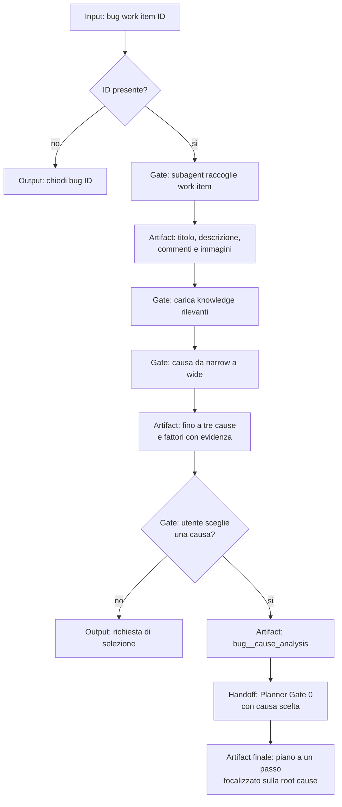

# Plan Bug From Id

[Indice mappe](../README.md) · [Contratto canonical](../../../system/canonical/skills/plan-bug-from-id/SKILL.md)

## In 30 Secondi

**Fa:** parte da un bug work item, raccoglie prova, formula fino a tre cause probabili e fa scegliere all'utente una sola causa radice da pianificare.

**Non fa:** non pianifica una correzione prima della scelta dell'utente, non risolve sintomi senza causa e non espande il piano oltre una modifica indipendente e testabile.

**Consegna:** artifact del bug, analisi della causa selezionata e un input ristretto per il workflow del Planner.

## Flusso, Gate E Artifact

## Lettura Del Diagramma

| Gate | Decisione che protegge | Artifact o output | Handoff successivo |
| --- | --- | --- | --- |
| ID e raccolta | Esiste il bug da analizzare? | Artifact work item con evidenza disponibile | Knowledge |
| Knowledge e indagine | Quali cause e fattori sono sostenuti da prova? | Fino a tre cause probabili | Utente |
| Selezione | Quale causa vuole affrontare il committente? | Scelta esplicita o richiesta di selezione | Artifact causa |
| Artifact causa | La root cause e abbastanza precisa per un piano? | `bug_<id>_cause_analysis` | Planner |
| Piano | La correzione e una sola modifica testabile alla causa? | Piano a un passo | Implementor dopo approvazione |

**Da ricordare:** questo workflow non sceglie la correzione per l'utente. Trasforma la scelta in un artifact che restringe il piano alla causa radice.

## Portabilità Del Sistema Generato

La mappa sopra descrive il contratto canonical. Nel sistema generato, Bootstrap risolve la raccolta tramite delega quando supportata o esecuzione inline prevista dalla piattaforma, mantenendo evidenza e confini. Tracker e persistenza devono avere binding approvati e funzionanti; riprendere solo la sessione nota senza enumerare altre sessioni. Recuperare i riferimenti espliciti del work item corrente senza espansione ricorsiva. Fonte: [changelog Bootstrap 4.0.0 e precedenti](../../../public-package/CHANGELOG.md) e [decisioni](../../../public-package/skills/agentic-system/bootstrap-agentic-system/contracts/discovery-and-decisions.md).
