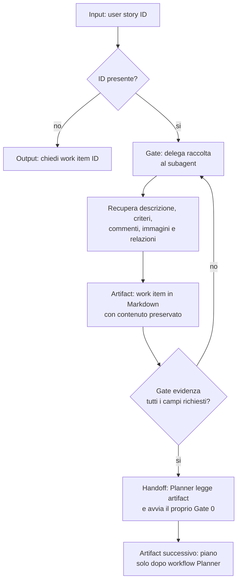

# Plan User Story From Id

[Indice mappe](../README.md) · [Contratto canonical](system/canonical/skills/plan-user-story-from-id/SKILL.md)

## In 30 Secondi

**Fa:** raccoglie da un user story work item una rappresentazione completa e leggibile dal Planner, delegando il recupero dell'evidenza a un subagent.

**Non fa:** non progetta la soluzione e non sostituisce il workflow del Planner; se manca l'ID, si ferma e lo chiede.

**Consegna:** artifact di sessione con descrizione, acceptance criteria, commenti, immagini e relazioni, pronto per il gate di pianificazione.

## Flusso, Gate E Artifact

## Lettura Del Diagramma

| Gate | Decisione che protegge | Artifact o output | Handoff successivo |
| --- | --- | --- | --- |
| ID | Esiste un work item da recuperare? | ID valido o richiesta all'utente | Raccolta |
| Raccolta delegata | L'evidenza viene recuperata senza progettare? | Descrizione, commenti, criteri, immagini e relazioni | Gate evidenza |
| Evidenza | Tutti i campi richiesti sono disponibili e leggibili? | Artifact work item completo | Planner |
| Handoff | Chi puo trasformare prova in design? | Artifact di sessione | Planner, poi Implementor dopo approvazione |

**Da ricordare:** questa skill separa il recupero dal giudizio di design. Il Planner riceve una prova completa, non un piano implicito.

## Evidenza Del Work Item

La mappa sopra descrive il contratto canonical. Tracker e persistenza devono avere fonti leggibili e binding verificati; riprendere solo la sessione nota senza enumerare altre sessioni. Recuperare i riferimenti espliciti del work item corrente senza espansione ricorsiva.
