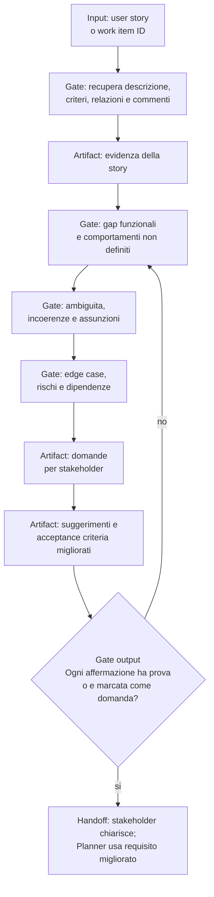

# User Story Analysis

[Indice mappe](../README.md) · [Contratto canonical](../../system/canonical/skills/user-story-analysis/SKILL.md)

## In 30 Secondi

**Fa:** analizza criticamente una user story prima del design, esponendo ciò che manca, e le conseguenze di ambiguita, assunzioni, casi limite e rischi.

**Non fa:** non inventa requisiti. Quando mancano dettagli, li trasforma in domande per stakeholder e suggerimenti di miglioramento.

**Consegna:** un'analisi strutturata che rende il requisito piu verificabile prima che un Planner lo trasformi in piano.

## Flusso, Gate E Artifact

## Lettura Del Diagramma

| Gate | Decisione che protegge | Artifact o output | Handoff successivo |
| --- | --- | --- | --- |
| Recupero | Quale evidenza definisce davvero la story? | Descrizione, criteri, commenti e relazioni | Analisi |
| Gap e ambiguita | Cosa manca, e cosa puo avere piu interpretazioni? | Gap, incoerenze e assunzioni esplicite | Scenari |
| Scenari e rischi | Quali casi limite, dipendenze e rischi richiedono decisione? | Inventario di scenari e rischi | Domande |
| Domande e miglioramenti | Come si ottiene un requisito piu preciso senza inventarlo? | Domande stakeholder e proposte di AC | Gate output |
| Gate output | Ogni punto e provato o identificato come aperto? | Analisi affidabile | Stakeholder e Planner |

**Da ricordare:** il valore della skill e rendere esplicita l'incertezza. Un requisito migliore nasce da domande tracciabili, non da dettagli aggiunti dall'analista.
