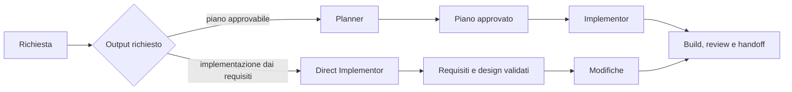

# Slide 1: Ruoli e Autorità

[Indice slide](README.md) · [Principi](../principles.md) · [Confronto dei ruoli](../role-maps/README.md)

**Failure mode:** un agente decide scope, modifica e si attribuisce approvazione senza limiti osservabili.

**Controllo:** scegliere il contratto per autorità e output richiesti.

**Evidenza:** [Direct Implementor](../role-maps/agents/direct-implementor.md) conserva gate e controllo umano senza piano intermedio; non crea test unitari o di integrazione.

**Esercizio:** scegli il percorso per le due varianti del [caso condiviso](../workshop-exercise.md); indica un'azione vietata e la prova necessaria.

**Decisione trasferibile:** un ruolo delimita responsabilità; il numero di agenti non dimostra il controllo.
