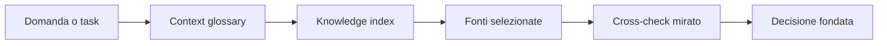

# Slide 2: Conoscenza

[Indice slide](README.md) · [Principi](../principles.md)

**Failure mode:** ricerca larga e pattern esistenti adottati senza verificarne l'autorita.

**Controllo:** seleziona poche fonti autorevoli prima dell'esplorazione del codice.

**Evidenza:** il Knowledge Builder costruisce conoscenza riusabile; Ask e Planner la leggono prima di concludere.

**Esercizio:** scegli tre fonti per un cambiamento rischioso e nomina una fonte plausibile da escludere.

**Decisione trasferibile:** conoscenza giusta significa selezionata, non massima.