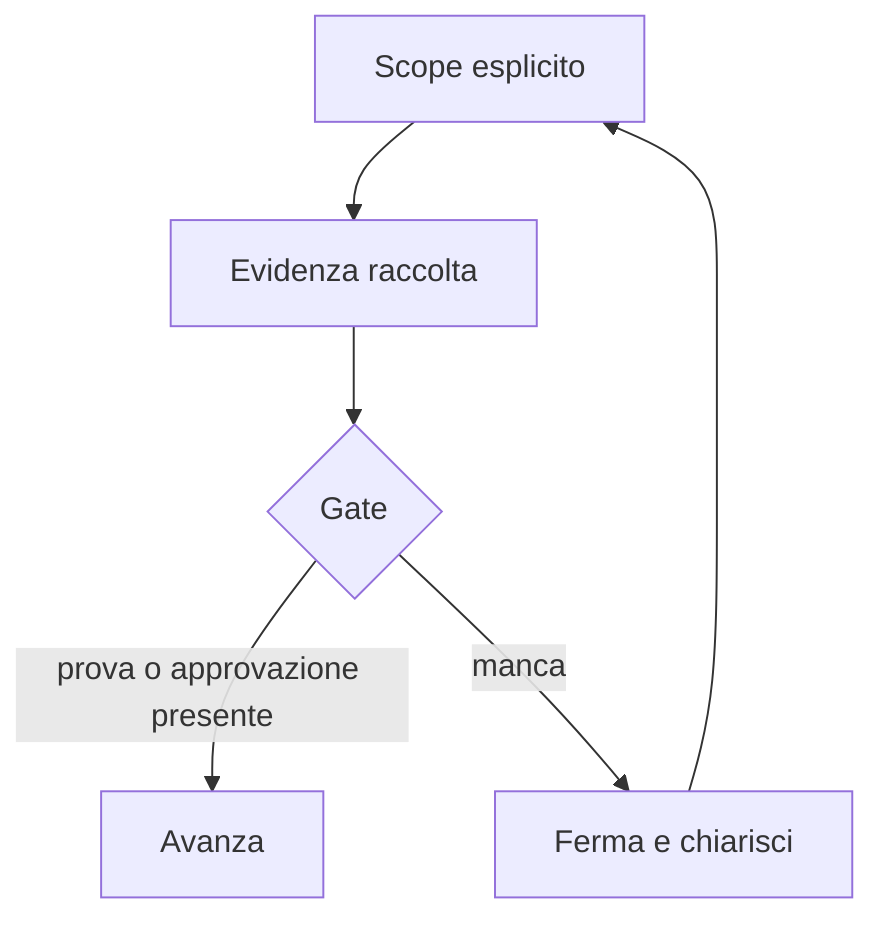

# Slide 3: Gate

[Indice slide](README.md) · [Principi](../principles.md)

**Failure mode:** l'implementazione parte prima che scope, rischio e approvazione siano osservabili.

**Controllo:** un gate dichiara cosa blocca, quale prova sblocca e chi puo accettarla.

**Evidenza:** Implementor usa un piano approvato; [Direct Implementor](../role-maps/agents/direct-implementor.md) passa da intervista e design validati. Tutti i gate prescritti restano ordinati; solo quelli che richiedono input umano impongono quella pausa.

**Esercizio:** disegna due gate proporzionati al rischio per una modifica di configurazione.

**Decisione trasferibile:** un gate rende esplicito quando il sistema puo avanzare.