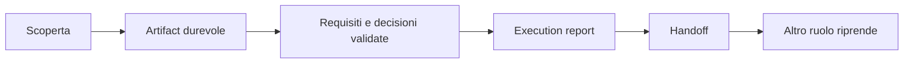

# Slide 4: Artifact

[Indice slide](README.md) · [Principi](../principles.md)

**Failure mode:** decisioni e risultati vivono solo nella memoria della chat.

**Controllo:** conserva decisioni, fonti, approvazioni, rischi e handoff in un record con proprietario.

**Evidenza:** anche Direct Implementor conserva inventario regole, risposte in memoria, log e report senza un piano intermedio. Riprendere solo la sessione nota per ID.

**Esercizio:** completa un handoff con decisione, fonte, rischio residuo e prossima prova.

**Decisione trasferibile:** la provenienza rende il lavoro riprendibile.