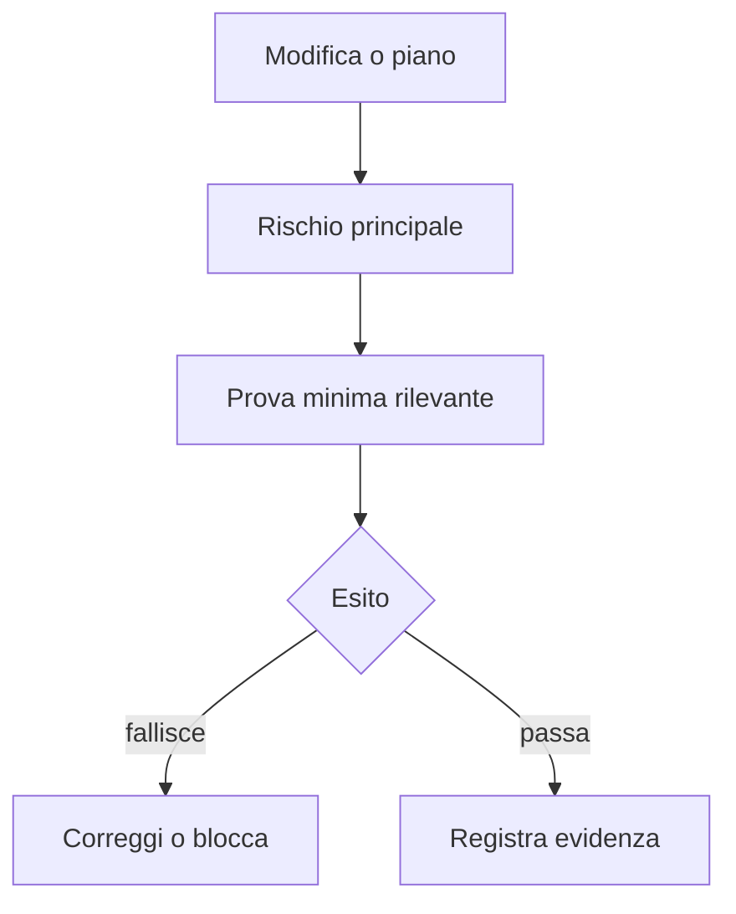

# Slide 5: Validazione

[Indice slide](README.md) · [Principi](../principles.md)

**Failure mode:** una dichiarazione dell'agente sostituisce una prova che potrebbe smentirla.

**Controllo:** scegli la prova minima che falsifica l'errore piu probabile e registra il rischio residuo.

**Evidenza:** Integration Tester produce test di integrazione senza modificare la produzione. Direct Implementor fa build e review ma non crea test: riportare le prove effettive e assegnare la verifica mancante a un workflow autorizzato.

**Esercizio:** per una regressione UI, scegli la prova piu piccola che potrebbe dimostrare che la correzione e sbagliata.

**Decisione trasferibile:** valida il rischio, non la fiducia.