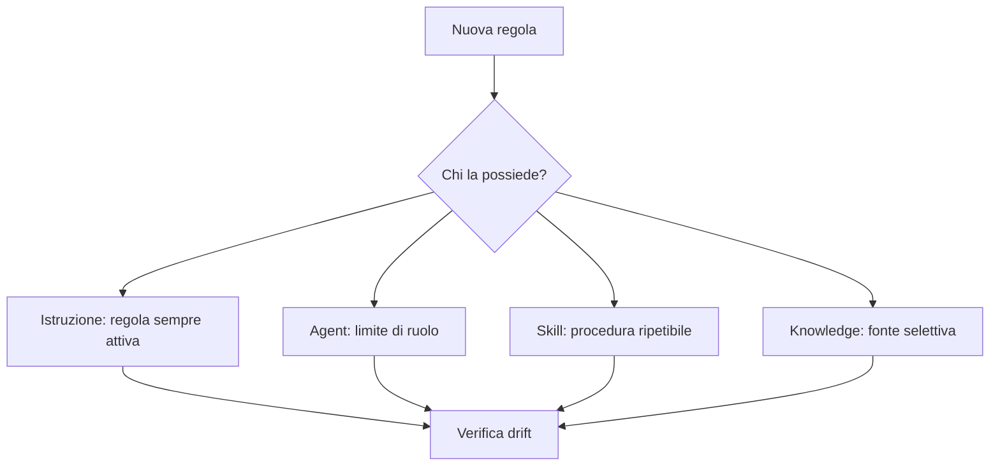

# Slide 6: Composizione

[Indice slide](README.md) · [Principi](../principles.md)

**Failure mode:** una regola e duplicata in istruzioni, agent, skill e documentazione, poi diverge.

**Controllo:** scrivi una regola nella superficie che la possiede e instrada le altre superfici verso quella fonte.

**Evidenza:** Author Repo Skill decide dove collocare una procedura. Maintainer confronta baseline, nuova resa e personalizzazioni; risolve le answers per il file esatto, senza prendere i tool di un altro ruolo.

**Esercizio:** assegna una nuova regola di review a una sola superficie proprietaria.

**Decisione trasferibile:** correggi la fonte, poi propaga gli output.