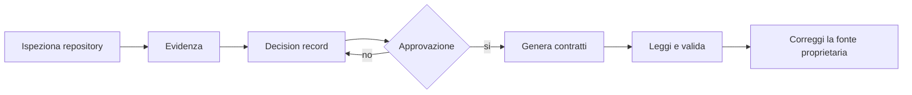

# Slide 7: Bootstrap

[Indice slide](README.md) · [Principi](../principles.md)

**Failure mode:** un template viene installato senza evidenza, approvazione o lettura dei contratti generati.

**Controllo:** genera dopo discovery limitata, decisioni esplicite e approvazione; poi leggi e valida l'output.

**Evidenza:** un binding approvato può essere nativo, skill, integrazione o fallback locale con prerequisiti verificati. Se Vision è selezionato, registrare modello esatto supportato o default della piattaforma approvato.

**Evidenza di compatibilità:** scegliere ambienti target separati dall'host; registrare client/versione, fonti ufficiali ed esiti per ruolo/operazione. Copie complete con soli slot approvati e adapter di caricamento preservano il contratto. Il confronto deterministico non prova l'esecuzione nel client.

**Esercizio:** nel [caso condiviso](../workshop-exercise.md), proporre un binding senza MCP e una scelta Vision per due ambienti. Uno è inaccessibile: distinguere `unverified` da `blocked` e indicare la prova mancante. Nessuna riscrittura fuori slot per far funzionare il secondo client.

**Decisione trasferibile:** adattare non significa riscrivere arbitrariamente; generare non significa aver finito di progettare.