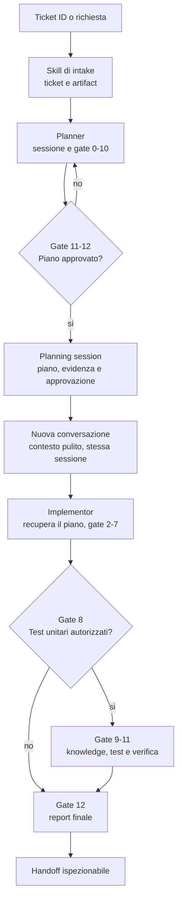

# Riferimento: Planner → Implementor

[Indice slide](README.md) · [Mappa Planner](../role-maps/agents/planner.md) · [Mappa Implementor](../role-maps/agents/implementor.md)

Questa pagina serve quando si vuole seguire **ogni gate**. Il [Planner canonical](../system/canonical/agents/planner.agent.md) e l'[Implementor canonical](../system/canonical/agents/implementor.agent.md) restano i contratti normativi. La sequenza seguente riassume il percorso ordinario con piano approvato. I gate numerati non si fondono o saltano durante l'esecuzione.

L'intake della user story può usare [Plan User Story From Id](../system/canonical/skills/plan-user-story-from-id/SKILL.md); quello del bug [Plan Bug From Id](../system/canonical/skills/plan-bug-from-id/SKILL.md). Il [contratto delle planning session](../system/canonical/instructions/planning-sessions.instructions.md) definisce l'evidenza che passa fra conversazioni. Il [Direct Implementor](../system/canonical/agents/direct-implementor.agent.md) è un percorso diverso, senza piano intermedio; vedi la sua [mappa](../role-maps/agents/direct-implementor.md).

## Gate del Planner

| Gate | Scopo in una frase | Evidenza o decisione |
| --- | --- | --- |
| 0. Request Scope | Verificare che la richiesta sia pianificabile | Scope valido o rifiuto |
| 1. Session Activation | Creare o riprendere la sessione nota | ID e stato di sessione |
| 2. Process Request and Handle Artifacts | Risolvere piano e materiali di ingresso | Artifact del requisito e immagini, se presenti |
| 3. Requirement Decomposition | Esporre capacità, scenari e lacune senza inventare | Output in chat, non artifact |
| 4. Knowledge Catalog | Leggere MustHave e PerContext/PerComponent applicabili | Inventario normativo persistito |
| 5. Codebase cold start understanding | Pianificare una ricognizione mirata | Piano di esplorazione |
| 6. Codebase Reconnaissance | Verificare fatti e collocazione nel codice | Riferimenti concreti al codice |
| 7. Structured Interview | Chiedere solo chiarimenti che bloccano il piano | Risposte dello stakeholder |
| 8. Answer Validation | Verificare risposte e ambiguità residue | Risposte valide o nuova domanda |
| 9. Knowledge Alignment | Controllare il design contro ogni regola applicabile | Allineamento ed eventuale discovery mirata |
| 10. Plan Drafting | Scrivere il piano e gli scenari di coverage secondo schema | Bozza verificata del piano |
| 11. Validation Request | Presentare il piano alla review umana | Attesa di approvazione |
| 12. Decision Processing | Registrare approvazione o richiesta di modifica | Stato di approvazione e piano salvato |
| 13. Final Handoff | Consegnare solo il piano approvato | Sessione pronta per Implementor |

Fonte: [contratto Planner](../system/canonical/agents/planner.agent.md) · [schema del piano](../system/canonical/templates/plan-schema.md). I gate 1, 2, 7 e 11 hanno stop point solo nelle condizioni definite dal contratto; gli altri avanzano secondo il suo modello di esecuzione.

## Gate dell'Implementor

| Gate | Scopo in una frase | Evidenza o decisione |
| --- | --- | --- |
| 0. Process user request | Valutare la richiesta speciale Business Logic Gap Detector, se invocata | Scope della richiesta speciale |
| 1. Business logic gap triage and repair | Gestire test rossi e correzione stretta nel percorso speciale | Esiti e report |
| 2. Session-managed plan resolution | Risolvere e caricare un piano approvato nel percorso ordinario | Piano selezionato o blocco |
| 3. Session artifacts and plan intake | Leggere piano e artifact pertinenti | Scope di esecuzione noto |
| 4. Code implementation | Applicare le modifiche autorizzate dal piano | File modificati e report |
| 5. Build and fix loop | Compilare e correggere errori in scope | Esito build |
| 6. Execute required commands | Eseguire i comandi del piano | Output dei comandi |
| 7. Review and validate | Confrontare lavoro e piano | Review e limiti |
| 8. Optional unit-test request | Chiedere approvazione esplicita per i test opzionali | Sì, no o assenza di scenari |
| 9. Knowledge refresh | Rileggere convenzioni di test applicabili | Fonti aggiornate |
| 10. Unit-test scope resolution | Decidere file e scope dei test autorizzati | Piano di test mirato |
| 11. Unit-test implementation and verification | Scrivere, eseguire e triagiare i test | Risultati e report |
| 12. Final summary | Distinguere modifiche, prove e rischio residuo | Handoff all'utente |
| 13. Refinements | Gestire eventuale ulteriore richiesta nel mandato | Nuova decisione o chiusura |

Fonte: [contratto Implementor](../system/canonical/agents/implementor.agent.md) · [Business Logic Gap Detector](../system/canonical/skills/business-logic-gap-detector/SKILL.md). I gate 0–1 sono condizionali alla richiesta speciale; i gate 8–11 dipendono dagli scenari di coverage e dall'approvazione richiesta dal contratto. La tabella non modifica l'ordine o le condizioni runtime.
