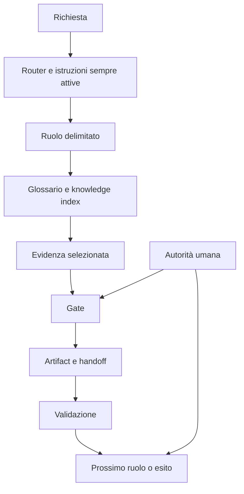
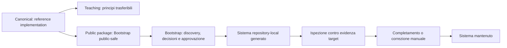
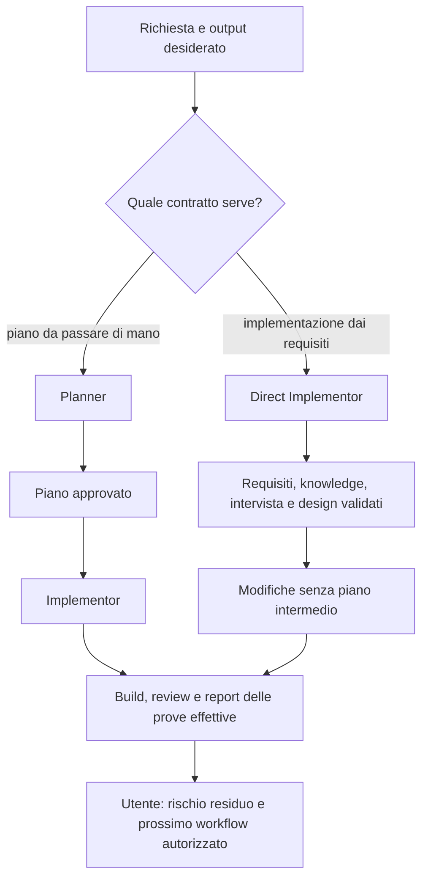

# Mappa del Sistema Agentico Enterprise

[Torna alla lettura principale](README.md) · [Principi](principles.md) · [Baseline dei principi](core-principles-baseline.md)

Questa mappa mostra relazioni didattiche. Non prescrive nomi di file, agent o directory per il repository target.

## Controlli Operativi

| Elemento | Responsabilità | Principio |
| --- | --- | --- |
| Router | Indirizza verso i contratti necessari | Composizione |
| Ruolo | Limita autorità, strumenti e output | Ruoli |
| Glossario | Stabilizza termini | Conoscenza |
| Knowledge index | Seleziona fonti operative | Conoscenza |
| Gate | Controlla la transizione | Gate |
| Artifact | Conserva prova, stato e handoff | Provenienza |
| Validation | Falsifica esiti non affidabili | Validazione |

## Ciclo di Vita delle Superfici

Il corso usa il sistema canonical e il Bootstrap public-safe per mostrare controlli osservabili. Il ciclo non autorizza il repository generato a diventare una seconda fonte di verita': il team deve verificare contratti, decisioni e validazioni contro la propria evidenza, poi mantenere o correggere la superficie che possiede la regola.

## Bootstrap Come Decisione Governata

```mermaid
flowchart LR
    Inspect[Ispeziona repository target] --> Evidence[Evidenza minima]
    Evidence --> Classify[Classifica inferenza o approvazione]
    Classify --> Slots[Personalization Slots]
    Slots --> Approval[Decisioni approvate]
    Approval --> Generate[Genera sistema locale]
    Generate --> Manifest[Manifest, answers e baseline]
    Manifest --> Review[Leggi i contratti generati]
    Review --> Validate[Valida contro il repository target]
    Validate --> Improve[Completa o correggi quando serve]
```

La domanda didattica non e' "quale comando genera i file?". E': "quale evidenza legittima questa personalizzazione, quale contratto generato va controllato e come potra' essere verificato dopo?".

## Due Percorsi Di Implementazione

[Confronto e scelta](role-maps/README.md) · [Gate del percorso diretto](role-maps/agents/direct-implementor.md). Il diagramma riassume i percorsi, non consente di accorpare i gate esecutivi. Direct Implementor non crea test; una successiva verifica richiede il mandato e l'intake del ruolo incaricato.

## Capability Portabili E Manutenzione

Un'operazione necessaria si lega a un tool nativo, una skill, un'integrazione configurata o un fallback locale approvato. Verificare input, output e prerequisiti prima di dichiararla disponibile. Senza subagent si usa il percorso inline previsto dal contratto generato; l'assenza di una piattaforma specifica non autorizza a omettere evidenza.

Per mantenere il sistema, confrontare baseline, nuova resa dalle answers e file corrente. Le answers specifiche di un ruolo si cercano con il percorso esatto del file generato: una entry assente richiede una decisione. Registrare la personalizzazione, evitando che il prossimo upgrade la tratti come una modifica sconosciuta.

### Manutenzione Di Più Ambienti

Separare delta canonical, cambiamenti della piattaforma e personalizzazioni del repository. Le [answers v2 e il contratto condiviso](../public-package/skills/agentic-system/bootstrap-agentic-system/contracts/platform-compatibility.md#maintenance) registrano ambienti, copie, adapter, fonti e stato delle prove. Migrare v1 conserva decisioni e baseline: non deduce ambienti dalle cartelle né promuove vecchi binding a verificati.

Prima di rimuovere un file condiviso, verificare i consumatori e le collisioni di discovery. Un override fuori slot resta un conflitto visibile da risolvere esplicitamente: conservarlo non rende la copia conforme. Aggiornare baseline ed evidenza solo dopo la verifica del risultato approvato, mantenendo espliciti gli esiti bloccati o non verificati.

[Torna alla lettura principale](README.md)
