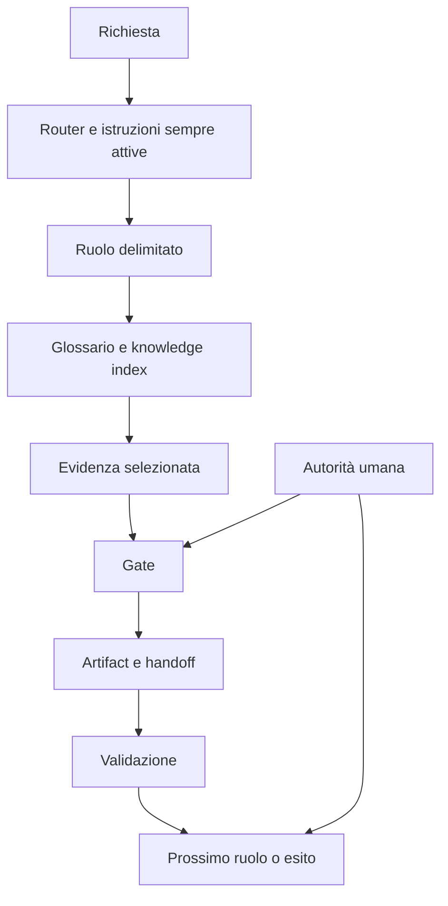
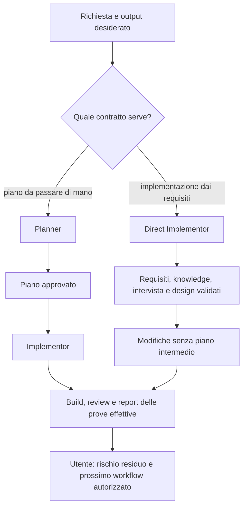
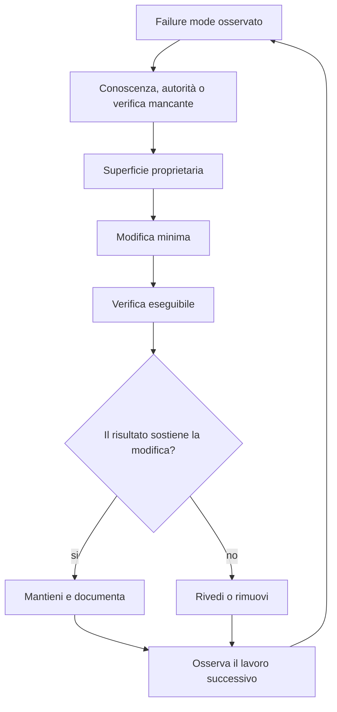

# Mappa del Sistema Agentico Enterprise

[Torna alla lettura principale](README.md) · [Principi](principles.md)

Questa mappa mostra relazioni didattiche. Non prescrive nomi di file, agent o directory per il repository target.

## Controlli Operativi

| Elemento | Responsabilità | Principio |
| --- | --- | --- |
| Router | Indirizza verso i contratti necessari | Composizione |
| Ruolo | Limita autorità, strumenti e output | Ruoli |
| Glossario | Stabilizza termini | Conoscenza |
| Knowledge index | Seleziona fonti operative | Conoscenza |
| Gate | Controlla la transizione | Gate |
| Artifact | Conserva prova, stato e handoff | Provenienza |
| Validation | Falsifica esiti non affidabili | Validazione |

## Due Percorsi Di Implementazione

[Confronto e scelta](role-maps/README.md) · [Gate del percorso diretto](role-maps/agents/direct-implementor.md). Il diagramma riassume i percorsi, non consente di accorpare i gate esecutivi. Direct Implementor non crea test; una successiva verifica richiede il mandato e l'intake del ruolo incaricato.

## Ciclo Di Manutenzione

Il ciclo mantiene le regole nella superficie che le possiede e usa le altre superfici per instradare, non duplicare. Il risultato della verifica deve distinguere ciò che è stato controllato dal rischio che resta aperto.

[Torna alla lettura principale](README.md)
